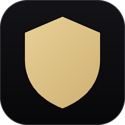

<div align="center">



# AEGIS

**A**utonomous **E**ncrypted **G**uardian for **I**dentity **S**ecurity

An offline, single-file password and identity vault. No server, no account,
no cloud, no telemetry — everything happens on your own machine.

</div>

---

## What it is

Aegis stores your accounts — usernames, passwords, API keys, SSH keys,
database credentials, notes — encrypted under one master password you
choose. It runs as a single local web page (`index.html`); there is no
backend, no network call of any kind, and no data ever leaves your device.

Everything is organized by **platform** (Discord, GitHub, a custom service,
whatever you add) and each platform can hold any number of accounts. Every
account is one of four types, each with its own relevant fields:

| Type | Fields |
|---|---|
| **Login** | username, email, password, proxy, phone, status, notes |
| **API Key** | label, key, scopes, rotation-age indicator |
| **SSH** | host, user, key type, private key |
| **Database** | host, database name, user, password, TLS flag |

## Security model

**Cipher:** AES-256-GCM (authenticated encryption).
**Key derivation:** Argon2id (64 MiB memory-hard), with a PBKDF2-SHA256
(600,000 iterations) fallback on hosts where WebAssembly is unavailable.
Your derived key exists in memory only and is wiped on lock; nothing is
ever written to disk unencrypted.

**What this actually protects against:** if someone obtains the encrypted
vault itself — a stolen backup file, a copied browser storage file, a disk
image — they cannot recover your master password, the derived key, or any
plaintext without the master password itself. That holds regardless of how
long they hold the ciphertext or what future computing power they bring to
it, as long as the underlying primitives stay uncompromised.

**What it cannot protect against:** an attacker with live control of your
*unlocked* device. While the vault is open, plaintext exists in memory and
on screen — no software-only vault can prevent capture of what's actively
being displayed. Auto-lock (5 minutes idle), clipboard auto-clear (30
seconds after copying a secret), and never transmitting plaintext anywhere
shrink that window; nothing shrinks it to zero. This is true of every
password manager, not a weakness unique to Aegis. The in-app **Security**
tab states this plainly rather than overselling what encryption can do.

**Extra layers, honestly scoped:**
- **Sentinel** — optional TOTP (authenticator app) unlock. A convenience
  lock for shoulder-surfers and walk-ups, *not* a second wall: a 6-digit
  code is too small to derive an encryption key from, so enrolling it
  seals your master password on-device under a key derived from the
  authenticator secret. Your master password remains the strong path.
- **Duress vault** — a second password that opens a completely separate,
  independently encrypted vault pre-filled with plausible accounts, in
  case you're ever forced to unlock the app. It's a detection/coercion
  feature, not a disguise applied to the real vault — the real vault's
  ciphertext is never touched by it.

No anti-debugger tricks, no "corrupt the data on tamper" logic, no
self-destruct. A wrong key already fails AES-GCM's authentication tag —
indistinguishable from noise, with zero risk of a false trigger destroying
real data. That's the honest version of "wrong key gets nothing."

## Password generator

Two modes: character-based (up to 100 characters, configurable charset,
CSPRNG-sourced via `crypto.getRandomValues`) and passphrase-based (4–10
words from the EFF's 1,296-word list, also CSPRNG-drawn). Both show real
entropy, odds of a correct guess, and time-to-crack figures — expressed as
actual numbers, not comparisons to the age of the universe.

## Running it

Aegis is one HTML file plus a small `vendor/` folder — no build step, no
install, works fully offline the moment you have it on disk.

**Easiest: download a release.** Grab the zip/tarball for your OS from the
[Releases page](../../releases) and run the `Aegis` executable inside —
it opens the vault in its own app-style window (no browser bar or tabs).

**From source**, any OS with Python 3 installed:
```bash
python aegis_launcher.py
```
This looks for an installed Chromium-family browser (Edge, Chrome, Brave,
or Chromium, in that order) and opens the vault in app mode; if none is
found, it falls back to your default browser. `index.html` on its own
works too — just open it directly in any modern browser.

**Building the executable yourself:**
```bash
pip install pyinstaller pillow
pyinstaller aegis.spec --noconfirm
```
Produces `dist/Aegis.exe` (Windows), `dist/Aegis.app` (macOS), or
`dist/Aegis` (Linux — pair it with `linux/aegis.desktop` for a menu entry,
editing the paths inside to wherever you extracted it).

On first launch you'll be asked to choose a master password. **It is never
stored anywhere and there is no recovery** — losing it means losing the
vault. Back it up regularly from **Backup & Keys → Export .vlt backup**;
the exported file is the same ciphertext, still locked by your master
password, safe to store anywhere.

## Project layout

```
index.html          the entire application (vanilla HTML/CSS/JS, no framework)
vendor/              Argon2id (hash-wasm) and the EFF diceware word list
aegis_launcher.py    cross-platform launcher (Windows/macOS/Linux)
aegis.spec           PyInstaller build spec for the packaged executables
icon/                app icon source + generated .ico/.icns/.png
linux/               Linux .desktop entry template
.github/workflows/   CI that builds all three platform executables on tag push
```

## License

MIT — see [LICENSE](LICENSE).
