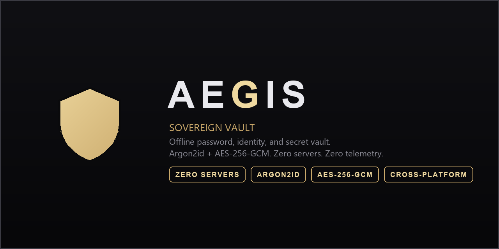

<div align="center">



[](https://github.com/voyb/aegis-vault/actions/workflows/build.yml)
[](https://github.com/voyb/aegis-vault/releases/latest)
[](LICENSE)


An offline password, identity, and secret vault. No server, no account,
no cloud, no telemetry. Everything happens on your own machine.

**[Install in one line ↓](#install)** · [How it works](#security-model) · [Why I built this](#the-story)

</div>

---

## Install

Pick your OS, paste one line into a terminal. That is the entire install.

**macOS / Linux**
```bash
curl -fsSL https://raw.githubusercontent.com/voyb/aegis-vault/main/install.sh | bash
```

**Windows** (PowerShell)
```powershell
irm https://raw.githubusercontent.com/voyb/aegis-vault/main/install.ps1 | iex
```

That downloads the right build for your OS, drops it in `~/Aegis`, and
launches it. No admin rights, no package manager, no dependencies, nothing
left behind if you delete the folder. First launch asks you to choose a
master password, and you are in.

## What it is

Aegis stores your accounts: usernames, passwords, API keys, SSH keys,
database credentials, notes, encrypted under one master password you
choose. It runs as a single local web page; there is no backend and no
network call of any kind.

Everything is organized by platform (Discord, GitHub, a custom service,
whatever you add), and each platform holds any number of accounts. Every
account is one of four types, each with the fields that actually matter
for it:

| Type | Fields |
|---|---|
| **Login** | username, email, password, proxy, phone, status, notes |
| **API Key** | label, key, scopes, rotation age indicator |
| **SSH** | host, user, key type, private key |
| **Database** | host, database name, user, password, TLS flag |

## Try it in 60 seconds

1. Run the install command above. Aegis opens in its own window.
2. Choose a master password. This is the only password you will ever
   need to remember, write it down somewhere safe until it is memorized.
3. Click **Add Platform**, pick GitHub (or type any custom name), then
   **Add Account**.
4. Pick the account type. For a GitHub personal access token, choose
   **API Key**, paste it into the Key field, tag it with scopes like
   `repo, workflow`, and save.
5. Click into **Password Generator** and switch to Passphrase mode for
   something you could actually read over the phone, or Characters mode
   for maximum entropy. Either way, copy it straight into the field you
   needed it for.
6. Open **Security** and read exactly what the encryption underneath you
   does and does not protect against. No app should ask for your secrets
   without telling you that up front.

That is the whole workflow. Everything else, the duress vault, TOTP
unlock, encrypted backups, is there when you want it and invisible when
you do not.

## How it compares

**vs. Bitwarden / 1Password:** no servers to maintain, no cloud account,
no subscription, and nothing to be compromised in when the vendor
eventually is. Your vault is not on a target list because there is no
list.

**vs. KeePass / KeePassXC:** a modern web-based interface in a single
file instead of a heavier native client, with typed profiles for API
keys, SSH keys, and database credentials built in from the start rather
than stuffed into generic notes fields.

## The philosophy

I wanted three things in one tool: a genuinely secure password manager, a
generator that produces passwords no realistic attack ever cracks, and a
profile display and management system that treats an API key or an SSH
key as a first-class citizen, not an afterthought bolted onto a username
and password field. Nothing on the market did all three without also
wanting my data on their servers.

Everything after that first decision got filtered through one equation,
Alex Hormozi's value equation:

```
Value = (Dream Outcome x Perceived Likelihood of Achievement) / (Time Delay x Effort and Sacrifice)
```

That is not a slogan I bolted on afterward, it is the actual design
process. Every feature had to either raise the top of that fraction or
shrink the bottom, or it did not ship.

- **Dream outcome**: your secrets are actually safe, provably, forever,
  not "safe until the company that holds them has a bad quarter."
- **Perceived likelihood of achievement**: real, named cryptography
  (Argon2id, AES-256-GCM), and a Security page inside the app that tells
  you exactly what it protects against and what it does not, instead of
  marketing copy.
- **Time delay**: one line in a terminal to a running app. No signup, no
  email verification, no onboarding flow.
- **Effort and sacrifice**: no server to configure, no subscription, no
  account, single executable, works the moment you have it.

Maximize the top, shrink the bottom. That is the whole design brief.

## The story

I started this in February, on a bare `index.html` file, because I
wanted a password manager that could not be taken from me by someone
else's bad decision. Every serious vault I looked at lived on a company's
servers, and a server is just a promise: a promise the company stays
funded, stays honest, stays un-hacked, and never gets acquired by someone
with different priorities. I did not want to store my accounts as a bet
on a stranger's uptime. If a provider gets breached or shuts down, that
is their emergency. I did not want it to be mine too.

So I built it to have nothing to breach. No server means no server to
hack. No account means no database of everyone's vaults sitting on one
target. The only copy of your data lives on your machine, encrypted, and
the only way in is the password in your head. That is not a compromise
version of a real password manager, it is the actual threat model most
people should want.

What kept me at it for months after the first working version was
honestly just that I like building things. Every feature that got added
came from actually using the app and wanting more from it: typed
credential profiles because a raw username and password field is the
wrong shape for an SSH key, a duress vault because "what if someone
forces me to unlock this" is a real question worth a real answer, a
password generator that shows its work in actual entropy bits instead of
a vague strength bar. It grew the way software should grow, from use, not
from a spec written in advance.

## Security model

**Cipher:** AES-256-GCM (authenticated encryption).
**Key derivation:** Argon2id (64 MiB memory-hard), with a PBKDF2-SHA256
(600,000 iterations) fallback on hosts where WebAssembly is unavailable.
Your derived key exists in memory only and is wiped on lock, nothing is
ever written to disk unencrypted.

**What this actually protects against:** if someone obtains the encrypted
vault itself, a stolen backup file, a copied browser storage file, a disk
image, they cannot recover your master password, the derived key, or any
plaintext without the master password itself. That holds regardless of
how long they hold the ciphertext or what future computing power they
bring to it, as long as the underlying primitives stay uncompromised.

**What it cannot protect against:** an attacker with live control of your
unlocked device. While the vault is open, plaintext exists in memory and
on screen, no software-only vault can prevent capture of what is actively
being displayed. Auto-lock (5 minutes idle), clipboard auto-clear (30
seconds after copying a secret), and never transmitting plaintext
anywhere shrink that window, nothing shrinks it to zero. This is true of
every password manager, not a weakness unique to Aegis. The in-app
Security page states this plainly instead of overselling what encryption
can do.

**Extra layers, honestly scoped:**
- **Sentinel**: optional TOTP (authenticator app) unlock. A convenience
  lock for shoulder-surfers and walk-ups, not a second wall: a 6-digit
  code is too small to derive an encryption key from, so enrolling it
  seals your master password on-device under a key derived from the
  authenticator secret. Your master password remains the strong path.
- **Duress vault**: a second password that opens a completely separate,
  independently encrypted vault pre-filled with plausible accounts, in
  case you are ever forced to unlock the app. It is a detection and
  coercion feature, not a disguise applied to the real vault, the real
  vault's ciphertext is never touched by it.

No anti-debugger tricks, no corrupt-the-data-on-tamper logic, no
self-destruct. A wrong key already fails AES-GCM's authentication tag,
indistinguishable from noise, with zero risk of a false trigger
destroying real data. That is the honest version of "wrong key gets
nothing."

## Password generator

Two modes: character-based (up to 100 characters, configurable charset,
CSPRNG-sourced via `crypto.getRandomValues`) and passphrase-based (4 to
10 words from the EFF's 1,296-word list, also CSPRNG-drawn). Both show
real entropy, real odds of a correct guess, and real time-to-crack
figures, expressed as actual numbers, not a comparison to the age of the
universe.

## Building it yourself

```bash
pip install pyinstaller pillow
pyinstaller aegis.spec --noconfirm
```
Produces `dist/Aegis.exe` (Windows), `dist/Aegis.app` (macOS), or
`dist/Aegis` (Linux, pair it with `linux/aegis.desktop` for a menu entry).
Or just run `python aegis_launcher.py` directly, no build step needed.

On first launch you will be asked to choose a master password. It is
never stored anywhere and there is no recovery, losing it means losing
the vault. Back it up regularly from Backup & Keys, Export .vlt backup,
the exported file is the same ciphertext, still locked by your master
password, safe to store anywhere.

## Trust, but verify

Security tools should not ask to be taken on faith. Every release binary
is built in the open by [GitHub Actions](.github/workflows/build.yml)
directly from the tagged commit, not on my machine, so the build log is
the proof it matches the source. Read [SECURITY.md](SECURITY.md) for how
to verify that yourself, report a vulnerability privately, or just see
what is in and out of scope.

Code reviews, security audits, and pull requests are genuinely welcome.
A tool like this gets better with more eyes on it, not fewer.

## Project layout

```
index.html          the entire application, vanilla HTML/CSS/JS, no framework
vendor/              Argon2id (hash-wasm) and the EFF diceware word list
aegis_launcher.py    cross-platform launcher (Windows/macOS/Linux)
aegis.spec           PyInstaller build spec for the packaged executables
install.sh           one-line installer for macOS/Linux
install.ps1          one-line installer for Windows
icon/                app icon source and generated .ico/.icns/.png
social/              social preview banner source
linux/               Linux .desktop entry template
.github/workflows/   CI that builds all three platform executables on tag push
SECURITY.md          how to verify builds and report vulnerabilities
```

## License

MIT, see [LICENSE](LICENSE).
